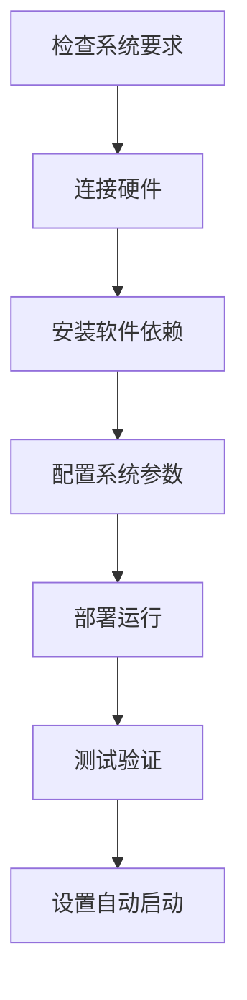

# 安装部署指南

## 📋 概述

本指南将帮助您在树莓派4或树莓派5上成功部署每日单词墨水屏显示系统。整个安装过程大约需要30-60分钟，具体时间取决于网络速度和硬件配置。

## 🎯 安装目标

完成本指南后，您将拥有：
- ✅ 完全配置的每日单词显示系统
- ✅ 自动定时更新功能
- ✅ 系统监控和日志记录
- ✅ 故障自动恢复机制

## 📚 安装步骤概览

| 步骤 | 文档 | 预计时间 | 难度 |
|------|------|----------|------|
| 1 | [系统要求检查](01-system-requirements.md) | 5分钟 | ⭐ |
| 2 | [硬件连接设置](02-hardware-setup.md) | 15分钟 | ⭐⭐ |
| 3 | [软件安装配置](03-software-installation.md) | 20分钟 | ⭐⭐⭐ |
| 4 | [系统参数配置](04-configuration.md) | 10分钟 | ⭐⭐ |
| 5 | [部署和运行](05-deployment.md) | 10分钟 | ⭐⭐ |

## 🚀 快速安装（推荐）

如果您熟悉Linux操作，可以使用自动安装脚本：

```bash
# 下载并运行自动安装脚本
curl -sSL https://raw.githubusercontent.com/your-repo/main/docs/assets/scripts/quick-install.sh | bash
```

> ⚠️ **注意：** 自动安装脚本适用于标准配置。如果您有特殊需求，请按照详细步骤手动安装。

## 📖 详细安装步骤

### 准备工作

在开始安装前，请确保：

1. **硬件准备完成**
   - 树莓派4/5已安装最新Raspberry Pi OS
   - 墨水屏模块已准备就绪
   - 网络连接正常

2. **权限确认**
   - 具有sudo权限的用户账户
   - 能够访问GPIO和SPI接口

3. **时间预留**
   - 预留1小时的安装时间
   - 确保安装过程不会被中断

### 安装流程



## 🔧 安装模式选择

根据您的需求选择合适的安装模式：

### 标准模式（推荐）
- 适用于大多数用户
- 包含完整功能
- 自动配置和优化

### 最小化模式
- 仅安装核心功能
- 占用资源最少
- 适合资源受限环境

### 开发模式
- 包含调试工具
- 详细日志记录
- 适合开发和测试

## 📋 安装前检查清单

在开始安装前，请确认以下项目：

- [ ] 树莓派4/5正常运行
- [ ] Raspberry Pi OS已更新到最新版本
- [ ] 网络连接稳定
- [ ] 墨水屏硬件准备就绪
- [ ] 具有sudo权限
- [ ] 预留足够的存储空间（至少1GB）

## 🆘 需要帮助？

如果在安装过程中遇到问题：

1. **查看对应章节的故障排除部分**
2. **检查[故障排除指南](07-troubleshooting.md)**
3. **查看系统日志获取详细信息**

## 📝 安装记录

建议在安装过程中记录以下信息：

- 安装开始时间：__________
- 树莓派型号：__________
- 墨水屏型号：__________
- 遇到的问题：__________
- 解决方案：__________
- 安装完成时间：__________

---

**下一步：** [检查系统要求](01-system-requirements.md)